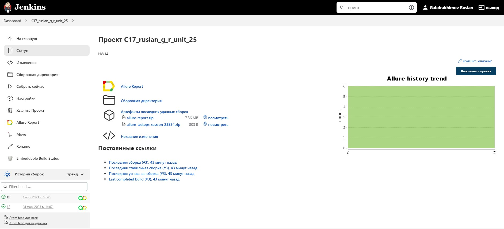
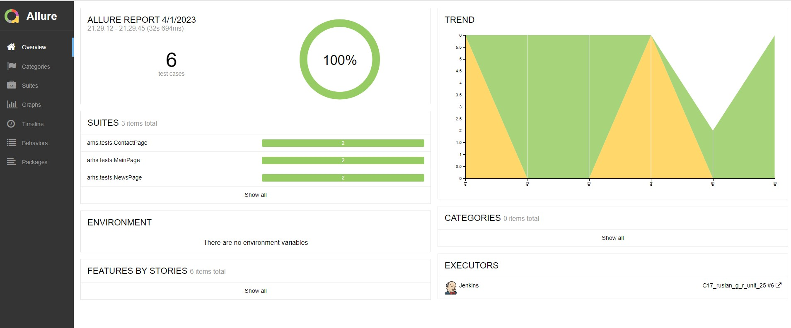
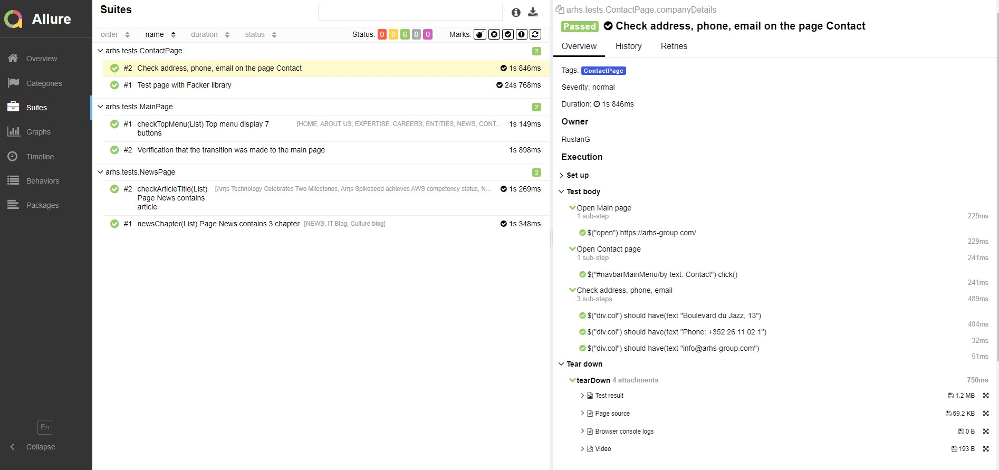
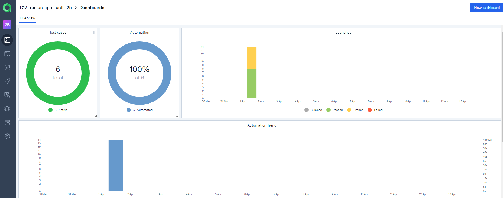
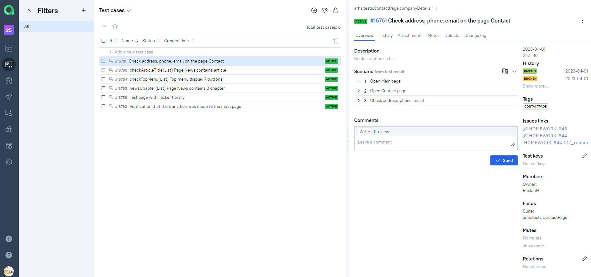
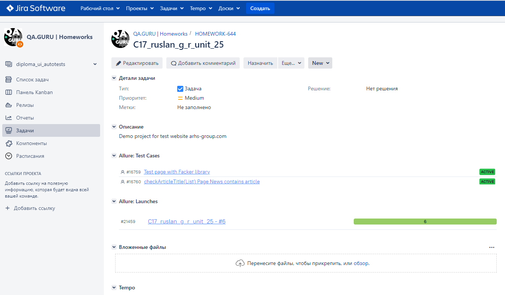
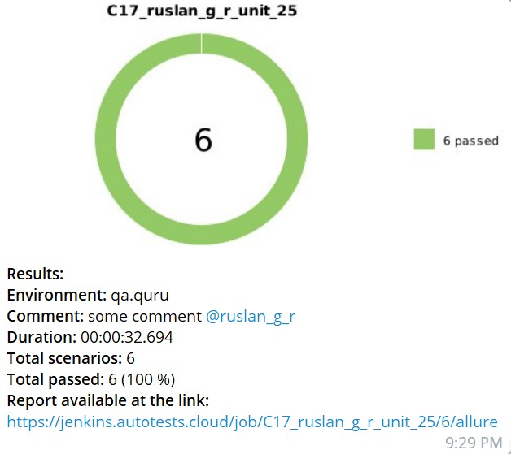

# :stars: Test automation project ARHS
<a target="_blank" href="https://arhs-group.com"></a>
## :card_file_box: Content

- [Technologies and tools](#earth_africa-stack technologies)
- [Implemented checks](#computer-implemented-checks)
- [Building in Jenkins](#earth_africa-Jenkins-job)
- [Run from terminal](#earth_africa-Running-tests-from-terminal)
- [Allure report](#earth_africa-Allure-report)
- [Integration with Allure TestOps](#earth_africa-Integration-Allure-TestOps)
- [Integration with Jira](#earth_africa-Integration-c-Jira)
- [Notification in Telegram](#earth_africa-Notification-in-Telegram-bot-assisted)
- [Video examples of passing tests](#earth_africa-test-passing-video examples)

## :bookmark: Technologies and tools

<p align="center">


</p>

Autotests are written in <code>Java</code> using <code>JUnit 5</code> and <code>Gradle</code>.
For UI tests, the [Selenide] framework (https://selenide.org/) was used.
Tests can be run locally or using [Selenoid](https://aerokube.com/selenoid/).
Also implemented build in <code>Jenkins</code> with generation of an Allure report and sending a notification with the results to <code>Telegram</code> after the run is completed.

Allure report includes:
* test execution steps;
* screenshot of the page in the browser at the end of the autotest;
* Page Source;
* browser console logs;
* video of the autotest.
## :computer: Implemented checks

- [x] *Checking header Top Menu*
- [x] *Verification that the transition was made to the main page*
- [x] *Checking  address, phone, email on the page Contact*
- [x] *Checking CONTACT FORM  on page Contacts*
- [x] *Page News contains 3 chapters*
- [x] *Page News contains article*

# :running_woman: Run tests

### Run tests locally
```
gradle clean test -Denv=local
```

If necessary, you can override the launch options
```
test/MainPage/ContactPage/NewsPage 

```

### Run tests on a remote browser
```
gradle clean test -Denv=remote
```
You can also override launch options if needed.

```
test/MainPage/ContactPage/NewsPage 
```
## :hammer_and_wrench:: Build options in Jenkins:

- remote (remote server address)
- browserSize (browser window size, default 1920x1080)
- browserVersion (browser version, default 100.0)
- browser (browser, chrome by default)


 

## </a> Build <a target="_blank" href="https://jenkins.autotests.cloud/job/C17_ruslan_g_r_unit_25/"> Jenkins </a>
<p align="center">
<a href="https://jenkins.autotests.cloud/job//"></a>
</p>

##  <a href="https://jenkins.autotests.cloud/job/C17_ruslan_g_r_unit_25/6/allure/">Example Allure-report</a>
### Overview

<p align="center">

</p>

### Test result

<p align="center">

</p>

##  Integration  [Allure TestOps](https://qameta.io/)

### Main Dashboard

<p align="center">
  
</p>

### Test case

<p align="center">
  
</p>

# Jira integration
<p align="center">
  
</p>


###  Telegram notifications using a bot

<p align="center">

</p>


###  Video of an example of running a test in Selenoid

A video is attached to each test in the report. One of these videos is shown below.
<p align="center">
  
</p>